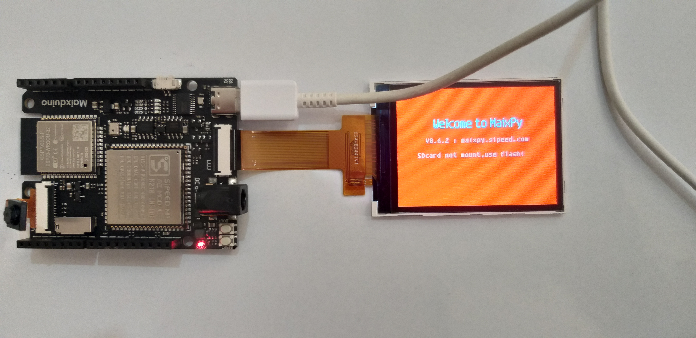

# MaixDuino

In this repository some guide into setting MaixDuino M1 board is provided. Maixduino consists of dual-core RISC-V processor and K210 AI Core. It is indeed a flexible and low power embedded system that can be used to develop AIoT applications.

## Setting Up
To start using MaixDuino you need a Type-C cable to connect it to your computer. Also a 24-pin LCD comes with the development board. Connect it to the main board. When you plug in the board, the LCD will display the following message:



This board comes with Micro Python installed. You can test it by serial port and running you scripts on it. 

First you need a serial terminal. In linux you can use `minicom` or `screen` to open a terminal. I used `screen` to open a terminal. Then you must find the serial port that is connected to your PC. Run the following command to find connected serial ports:

```
$ ls /dev/tty*
/dev/ttyUSB0  /dev/ttyUSB1
```

Then connect to the serial port using `screen`:

```
$ sudo screen /dev/ttyUSB0 115200 
```

Last argument shows the baud rate. Finally you will get a Python prompt. For more information refer to [MaixPy](https://wiki.sipeed.com/soft/maixpy/en/index.html) documentation.

## C++ baremetal programming

## Go baremetal programming


